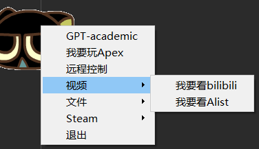
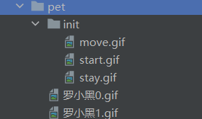

# 桌面宠物
## 功能

- 简单的拖拽，以及gif动画播放
- 自定义右键菜单
  - 通过修改config里面的menu_config.json即可修改右键菜单选项，并且也可以自定义脚本来简化电脑的使用
- 自定义桌宠样式
  - 只需要更换pet文件夹下面的gif图标即可实现替换桌宠样式

## 自定义脚本及右键菜单

右键菜单是可以自定义的，只需要对config文件夹下面的menu_config.json文件进行编辑即可动态的修改右键菜单的内容

​	

```json
{
    "主菜单": [
        {
            "name": "GPT-academic",
            "type": "subprocess.Popen",# 可选type类型：subprocess.run、subprocess.Popen、webbrowser(打开浏览器)
            "params": [
                "powershell",
                "-ExecutionPolicy",
                "Bypass",
                "-File",
                ".\\bat\\academic.ps1"
            ]
        },
		......
    ],
    "子菜单的名称": [
        {
            "name": "子菜单的名称",
            "type": "使用何种方式打开",
            "params": "参数"
        },
        {#示例 在浏览器中打开网站http://localhost:5244/
            "name": "我要看Alist",
            "type": "webbrowser",
            "params": "http://localhost:5244/"
        }
    ]
    ......
}

```

这里修改了 之后只是内容修改了 ，要想实现相应的功能需要在bat文件夹下创建相应的脚本

这是bat脚本示例 一般使用subprocess.run

```bat
@echo off
start "" "D:\Qingfeng\HeyboxAccelerator\heyboxacc.exe"
start "" "D:\Program Files (x86)\Tencent\TIM\Bin\QQScLauncher.exe"
start "" "D:\Program Files\Steam++\Steam++.exe"
```

这是powershell脚本示例 一般使用subprocess.Popen

```powershell
Start-Process "D:\sunshine\Sunshine\SunShine.exe" -WorkingDirectory "D:\sunshine\Sunshine"
Start-Process "C:\Program Files\Oray\SunLogin\SunloginClient\SunloginClient.exe"
Start-Process "C:\Program Files\Tailscale\tailscale-ipn.exe"
```

打开网页不需要配置脚本文件，直接在上面的配置文件中修改即可

## 自定义样式

这是桌面宠物样式文件夹的格式，

在pet文件下的init文件存放的是桌宠初始化的gif文件，这里面的文件名称必须符合下面的规则

- move.gif是桌宠被拖拽的样式
- start.gif是桌宠刚启动的样式
- stay.gif是桌宠被拖动过后的样式

然后pet文件夹下面的其他gif文件则是桌宠随机播放的文件，这里面的文件不用修改名字。

替换时只需要按照上面的规则来替换即可。




## 接入大语言模型（未完成）
